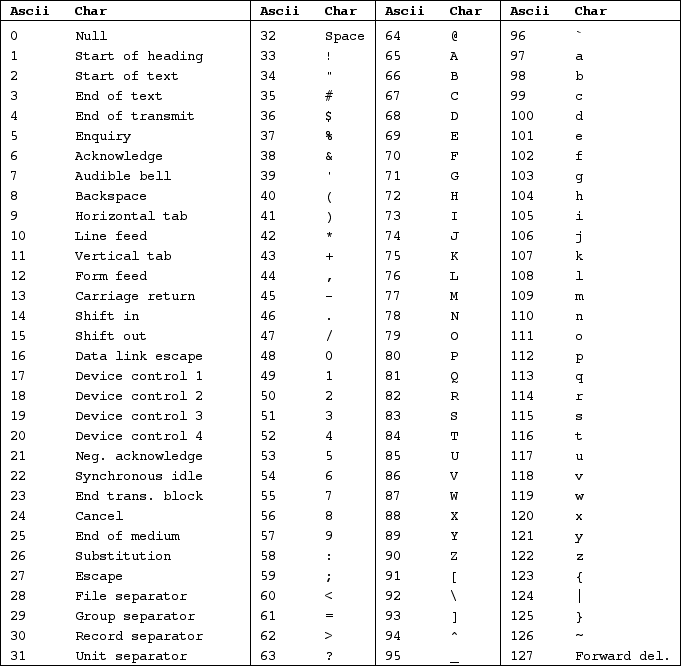

# Guidelines for Data Stored using the CSV File Format

The proposed CSV standard is derived from guidelines and recommendations defined by some popular Earth Science communities. The following details the guidelines and expectations for each data file that can responsibly be formatted as a flat file. Many of the standards correspond with fields included in the File-Level Metadata (FLMD) Guide. "Required' fields represent the ideal file for interoperable and machine-readable data. Descriptions with the phrase "must be documented elsewhere" references a yet-to-be-determined implementation of FLMD capture. These standards are a result of research and community feedback.  

**1. Use the standard US-ASCII character set without extensions.** *REQUIRED*  
Data stored using the comma separated values format (CSV) ([RFC 4180](https://tools.ietf.org/html/rfc4180)) must use the standard seven-bit American Standard Code for Information Interchange (US-ASCII) characters ([RFC 20](https://tools.ietf.org/html/rfc20)) (Table 1).  

Typically, programs used to create the data will use the UTF-8 character-encoding scheme by default, which includes all the US-ASCII charcters. However, the standard presented here requires that no extended characters be used beyond the 127 characters defined in the US-ASCII character set.  

The US-ASCII characters include all upper- and lowercase characters, digits, and common punctuation used in the English language. Given that English is considered the language of science, it is unlikley that data submissions will include characters not contained in the standard ASCII character set.  

This requirement will increase machine readability and interoperability, as  the extended characters can disrupt the rendering and interpretation of data in some programs. Most data providers will not need to do anything to meet this standard.  

**Table 1.** The ASCII Character Set. Control characters&mdash;0 through 32 and 127&mdash;can be ignored by most data providers.  
  

**2. Use unique, descriptive file names that follow the file naming conventions.** *REQUIRED*  
Unique file names must be used. Only letters, numbers, a hyphen "-" (ASCII Code 45), and an underscore "_" (ASCII Code 95) can be used in file names. No spaces are allowed, as spaces can interfere with machine readability and complicate directory navigation using command line.

**&mdash;Example: Descriptive File Name**
```
burned_plot_veg_2016.csv
```

**3. Use a comma as the delimiter.** *REQUIRED*  
The delimiter between columns must be the comma character "," (ASCII Code 44). This puts the "C" in the "CSV" file format, and is common for "flat-file" encoding.

**&mdash;Example: Comma Delimited Data**  
```
variable_1,variable_2,variable_3,
aaa,bbb,ccc,
```

**4. Avoid commas except as a delimiter.** *REQUIRED*  
If a comma is needed within a cell (i.e., not meant as a delimiter), use a vertical bar "|" (ASCII Code 124) instead of a comma.

**&mdash;Example: Vertical Bar Used as Comma**  
```
name_1,name_2,name_3,
Doe|Jane, Simpson|Bart, Smith|John,
```

Alternatively, commas that are not meant to be delimiters must be protected by matching quotation marks (“ or ‘) around the entire value.

**&mdash;Example: Commas Protected by Quotations**  
```
name_1,name_2,name_3,
"Doe, Jane", "Simpson, Bart", "Smith, John",
```

This requirement is necessary for machine readability, as unprotected commas will disrupt the interpretation of columns and rows. If data providers enter their data into programs like Microsoft Excel or Libre Office text cells will be detected and protected by quotiation marks automatically. Data that are output from models or written in a simple text editor might need quotation marks added to text cells manually.

**5. File organized as a matrix of rows and columns.** *REQUIRED*  
The contents of the file must be organized in a logical and readable matrix format.

**&mdash;Example: Matrix of Rows and Columns**  
| row 1 column 1 | row 1 column 2 | row 1 column 3 |
|---|---|---|
| row 2 column 1 | row 2 column 2 | row 2 column 3 |
| row 3 column 1 | row 3 column 2 | row 3 column 3 |
| row 4 column 1 | row 4 column 2 | row 4 column 3 |

**6. No empty rows or cells.** *REQUIRED*  
The file should have no empty rows so that there are no "skipped" lines or cells.

**&mdash;Example: Empty Rows and Cells**  
The third row has an empty cell and the fourth row is empty.
```
site,plot,plant_abundance,
lowland,1,47
lowland,2,,
,,,
highland,2,12
```

**7. Each row must have the same number of columns with variable names in the first row.** *REQUIRED*  
The file must contain the same number of columns across all of its rows, and the first row should be the variable names. Thus, all rows (records) will include the same data variables (columns).

**&mdash;Example: Inconsistent Column Number**  
The first row has only two columns while the reminder have three columns.
```
title,plant abundance across sites,
site,plot,plant_abundance,
lowland,1,47,
lowland,2,64,
highland,1,9,
highland,2,12,
notes,all sites were sampled
```

**8. Use unique, descriptive variable names that follow the variable naming conventions.** *REQUIRED*  
Unique variable names must be used, but no spaces between characters. Use names that are descriptive so that they are easily distinguished from one another and intelligible.

**&mdash;Example: Descriptive Variable Names**  
```
site,sample_year,soil_H20,mean_snow,sand_depth,pH
```

**9. Provide variable units of measurement.** *RECOMMENDED*  
Provide the units of measurement for the variable in the variable name following the same naming conventions for the variable. If units are not provided here, it must be documented elsewhere.

Data should be represented with units of measurement approved by the International System of Units (SI system), derived units (such as degree Celsius), or non-SI units accepted for use with SI (such as minute, hour, day, mixing ratio). Units of measurement and representations that do not conform to the international standards must be documented elsewhere.

**&mdash;Example: Units of Measurement**
```
location,plot,soil_type,soil_temp_c,total_depth_cm,bulk_density_g_cm-3
```

**10. Variable units, type, and precision consistent within columns.** *REQUIRED*  
All data within a column must use the same units of measurement. Text and numeric data must not be used in the same column. Precision refers to the number of decimal places used for a variable.

**&mdash;Example: Inconsistent Variable Type**  
The variable "soil_moisture" provides both numeric and factor data.
```
site,plot,species_richness,soil_moisture,
jeeves,1,6,high,
jeeves,2,9,high,
saddle,1,1,5.7,
saddle,2,1,3.0004,
```

**11. Use a consistent missing data value.** *REQUIRED*  
If a cell does not contain a value, a missing data value must be indicated. Missing data must be represented by values that can never be construed as actual data and must be consistent across variables.  

For columns containing numeric data, "-9999" is preferred as the missing data value or use the correct precision given the data in the column. For columns containing character data, the string "NA" is preferred as the missing data value.  

**&mdash;Example: Missing Data Values**
```
location,soil_moisture,class,
EVR,-9999,NA
EVR,103.7,vascular
EVV,87.1,moss
```

An explanation for missing values (i.e., flags) can be reported as a separate variable (column) as described below. If a coding system is used to describe the missing data value, it must be documented elsewhere.

**&mdash;Example: Missing Data Value Flags**  
The variable "soil_depth_cm_flag" provides a coding system (i.e, factor data type) to describe "soil_depth_cm".
```
plot,soil_depth_cm,soil_depth_cm_flag,
1,5,0,1
2,3.7,1
3,-9999,-1
```

**12. Provide variable measurement uncertainty, limits of detection, data quality indicators, and other flags.** *OPTIONAL*  
Measurement uncertainty, limits of detection,data quality indicators, and other flags should be reported as a separate variable (column) but within the same row for the corresponding value it describes. If a coding system is used to describe the flags, it must be documented elsewhere.

**&mdash;Example: Limits of Detection**  
The variable "iodine_LOD" provides numerical limits of detection.
```
sample,iodine,iodine_LOD,
1,0.000480,0.000494,
2,0.000101,0.000543,
3,0.000699,0.000456,
```
**&mdash;Example: Data Quality Indicators**  
The variable "albedo_flag" provides a coding system (i.e, factor data type) to decribe "albedo".
```
grid,albedo,albedo_flag,
1,106,1,
2,245,0,
3,966,2,
```

**14. Provide temporal data in UTC format.** *REQUIRED*  
All dates and times must be reported in Coordinated Universal Time (UTC) and follow the ISO 8601 standard ([RFC 3339](https://tools.ietf.org/html/rfc4180)). All times must be preceded with a date.

In cases where the entire file consists of temporal data collected for a single date and time, the date and time must be documented elsewhere.

Temporal data using different standards can be provided as a separate variable (column) in addition to UTC format.

**&mdash;Example: Temporal data reported in UTC format and local time.**
```
date,date_time,local_date_time
2011-06-17,2011-06-17_01:56:00,2011-06-16_21:56:00,
2011-06-18,2011-06-18_18:51:00,2011-06-18_14:51:00,
2011-07-07,2011-07-07_20:09:00,2011-07-07_16:09:00,
```

**15. Specify timestamps as the start, stop, midpoint, or average of measurement period.** *RECOMMENDED*  
For timestamped data, the variable name should specify if the measurement is the start, stop, or midpoint or it must be documented elsewhere.

**&mdash;Example: Timestamped data where the start and stop times for each record is indicated.**
```
Start_UTC,Stop_UTC,N2O_PPB,
59725.0,59728.0,328.1,
59795.0,59798.0,327.8,
59865.0,59868.0,328.2,
```

**16. Provide spatial data in WGS84 decimal format (EPSG:4326).** *REQUIRED*  
All geographic coordinates must be provided in WGS84 decimal format ([EPSG:4326](https://epsg.io/4326)). Latitude and longitude must be provided as separate variables.

**&mdash;Example: Spatial data reported in WGS84 format only.**
```
site,lat,lon,
MTC,64.9189321,-147.82157,
AZT,64.9189167,-147.8216,
```

Spatial data using different standards can be provided as a separate variable (column) in addition to WGS84 decimal format.

**&mdash;Example: Spatial data reported in WGS84 and UTM format.**
```
site,lat,lon,UTM_6_easting,UTM_6_northing,
MTC,64.9189321,-147.82157,461140.98,7199672.10,
AZT,64.9189167,-147.8216,461139.54,7199670.45,
```

In cases where the entire file consists of measurements collected at a single location, a pair of geographic coordinates must be documented elsewhere.
